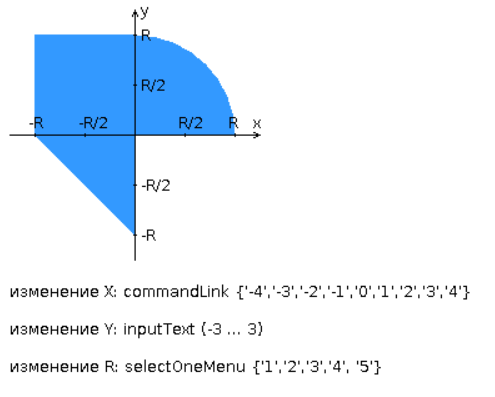

# Веб-программирование 🍻

## Лабораторная работа #2

### Вариант 321300

#### Разработать веб-приложение на базе сервлетов и `JSP`, определяющее попадание точки на координатной плоскости в заданную область

Приложение должно быть реализовано в соответствии с [шаблоном *MVC*](https://en.wikipedia.org/wiki/Model%E2%80%93view%E2%80%93controller) и состоять из следующих элементов:

- [x] **ControllerServlet**, определяющий тип запроса, и, в зависимости от того, содержит ли запрос информацию о координатах точки и радиусе, делегирующий его обработку одному из перечисленных ниже компонентов. Все запросы внутри приложения должны передаваться этому сервлету (по методу `GET` или `POST` в зависимости от варианта задания), остальные сервлеты с веб-страниц напрямую вызываться не должны.

- [x] **AreaCheckServlet**, осуществляющий проверку попадания точки в область на координатной плоскости и формирующий HTML-страницу с результатами проверки. Должен обрабатывать все запросы, содержащие сведения о координатах точки и радиусе области.

- [x] **Страница `JSP`**, формирующая HTML-страницу с веб-формой. Должна обрабатывать все запросы, не содержащие сведений о координатах точки и радиусе области.

#### Разработанная страница JSP должна содержать

- [x] "*Шапку*", содержащую ФИО студента, номер группы и номер варианта.

- [x] Форму, отправляющую данные на сервер.

- [x] Набор полей для задания координат точки и радиуса области в соответствии с вариантом задания.

  - [x] `X: Text { -3 ... 5 }`

  - [x] `Y: Text { -5 ... 3 }`

  - [x] `R: Select { '1', '2', '3', '4', '5' }`

- [x] Сценарий на языке JavaScript, осуществляющий валидацию значений, вводимых пользователем в поля формы.

- [x] Интерактивный элемент, содержащий изображение области на координатной плоскости (в соответствии с вариантом задания) и реализующий следующую функциональность:

  - [x] Если радиус области установлен, клик курсором мыши по изображению должен обрабатываться JavaScript-функцией, определяющей координаты точки, по которой кликнул пользователь и отправляющей полученные координаты на сервер для проверки факта попадания.

  - [x] В противном случае, после клика по картинке должно выводиться сообщение о невозможности определения координат точки. \
  *вообще, `R: Select`, так что значение есть всегда*

  - [x] После проверки факта попадания точки в область изображение должно быть обновлено с учётом результатов этой проверки (т.е., на нём должна появиться новая точка).

- [x] Таблицу с результатами предыдущих проверок. Список результатов должен браться из ~~контекста приложения~~, ~~HTTP-сессии~~ или **Bean-компонента** в зависимости от варианта.

#### Страница, возвращаемая AreaCheckServlet, должна содержать

- [x] Таблицу, содержащую полученные параметры.
- [x] Результат вычислений - факт попадания или непопадания точки в область.
- [ ] Ссылку на страницу с веб-формой для формирования нового запроса.

---

Разработанное веб-приложение необходимо развернуть на сервере [WildFly](https://wildfly.org/). Сервер должен быть запущен в **standalone-конфигурации**, порты должны быть настроены в соответствии с выданным **portbase**, доступ к **http listener'у** должен быть открыт для всех IP.

---

#### Вывод

Разработка веб-приложения с ислользованием jsp и сервлетов позваляет разделить приложение на функциональные части и, в зависимости от контекста, делегировать обработку запроса тому или иному компоненту.

- jsp удобны для создания веб-страниц
- сервлеты можно использовать для обработки иных запросов (прим: ajax)
